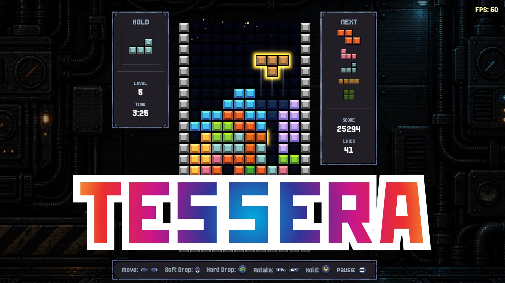
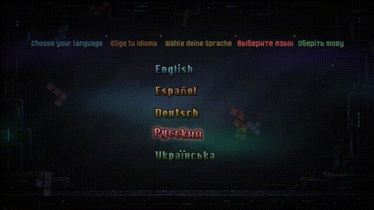
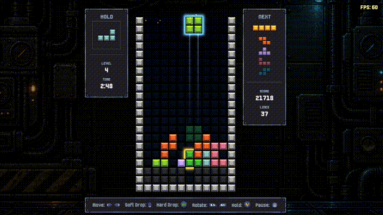
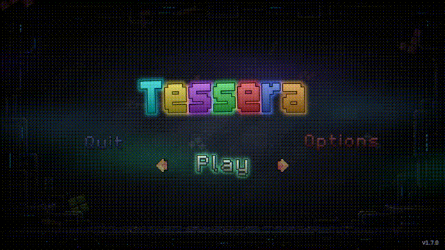
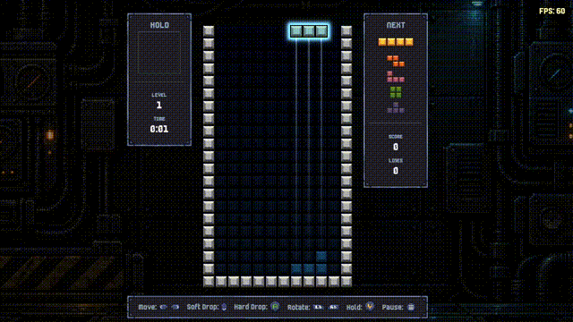

<h1 align="center">Tessera</h1>

<p align="center">
  A styled falling-block puzzle game — C++23 / SFML 3.1, hand-built engine, no game framework.
</p>

<p align="center">
  
  
  
  
  
  
</p>

<p align="center">
  <a href="#"><b>▶ Play on itch.io</b></a> <sub>(coming soon)</sub>
  &nbsp;·&nbsp;
  <a href="https://github.com/demianblogan/Tessera/releases/latest">Latest release</a>
  &nbsp;·&nbsp;
  <a href="https://www.youtube.com/watch?v=gs816D4Nyzo">Full playthrough</a>
</p>

<p align="center">
  
</p>

---

## What it is

Classic falling-block puzzle, rebuilt from scratch with a hand-written engine: a
proper 7-bag randomizer, standard SRS rotation and wall kicks, T-spins, combos,
back-to-back, Perfect Clear — and one continuous endless mode that quietly
ramps up the longer you survive. Stick around past the two-minute mark and the
board starts throwing Speed Surges, rising garbage and a rare golden piece that
doubles whatever you clear with it. Chase a spot on the local top-10 board.

<table align="center">
  <tr>
    <td align="center"><br><sub>Main menu</sub></td>
    <td align="center"><br><sub>Gameplay</sub></td>
  </tr>
  <tr>
    <td align="center"><br><sub>Options</sub></td>
    <td align="center"><br><sub>Pause menu</sub></td>
  </tr>
</table>

<p align="center">
  <a href="https://www.youtube.com/watch?v=gs816D4Nyzo">
    
  </a>
  <br>
  ▶️ <a href="https://www.youtube.com/watch?v=gs816D4Nyzo"><b>Watch the full playthrough</b></a>
</p>

---

## Download & play

- **Play on itch.io** — coming soon
- **[Download the latest release from GitHub](https://github.com/demianblogan/Tessera/releases/latest)**

1. Download `Tessera-vX.Y.Z-win64.zip`
2. Extract it anywhere
3. Run `Tessera.exe` — the SFML DLLs are bundled next to it

Windows 10 / 11, 64-bit. A gamepad is optional; Xbox and PlayStation
(DualSense / DualShock) layouts are built in and switched to automatically.

---

## Features

### Gameplay
- Standard 10×20 board with a 20-row hidden buffer above it, for tall spins
  and legal spawns
- Guideline **7-bag** randomizer, toggleable to pure random
- Standard **SRS** rotation and wall kicks; piece shapes and kick tables are
  data-driven from `assets/data/`, not hardcoded
- **Ghost piece**, **hold piece**, and a **next-queue preview** with a
  configurable depth (1–5 pieces)
- Full **T-spin** detection (regular and mini), **combos**, **back-to-back**,
  and a **Perfect Clear** bonus
- One continuous **endless mode** that escalates over time — see
  [Escalation](docs/GAMEPLAY.md#escalation) for the exact tiers and timings
- A local **top-10 leaderboard**, per-run name entry

### Presentation
- Neon glow shaders on the active piece, menu titles and UI
- Toggleable **CRT post-processing** filter
- Screen shake, row-clear flash / sweep / shatter, a T-spin burst, a
  board-wide Perfect Clear flourish, particle dust on landings and wall hits
- A fully animated main menu — drifting tetromino backdrop, aurora, a
  letter-by-letter title drop-in

### Options
- **Graphics** — resolution, Fullscreen / Windowed / Borderless, V-Sync, FPS
  counter, CRT filter toggle
- **Audio** — music and sound effect volume
- **Gameplay** — gamepad vibration and lightbar, screen shake, ghost piece,
  hold piece, next-queue length, 7-bag toggle
- **HUD** — independent visibility for every panel (Hold, Next, Score, Lines,
  Level, Time, controls legend)
- **Controls** — full keyboard rebinding
- **Language** — English, Spanish, German, Russian, Ukrainian

Full breakdown: **[docs/GAMEPLAY.md](docs/GAMEPLAY.md)**

---

## Controls

| Action | Keyboard | Gamepad |
|---|---|---|
| Move left / right | `←` `→` | D-pad / Left stick |
| Soft drop | `↓` | D-pad / Left stick (down) |
| Hard drop | `Space` | A / Cross |
| Rotate clockwise | `E` | Right bumper |
| Rotate counter-clockwise | `Q` | Left bumper |
| Hold | `C` | Y / Triangle |
| Pause | `Esc` | Menu button |
| Menus | Arrows, mouse, `Enter`, `Esc` | D-pad, ✕ / A confirm, ○ / B back |

All keyboard bindings can be reassigned in Options → Controls.
Full layouts, including DualSense rumble / lightbar / adaptive triggers:
**[docs/CONTROLS.md](docs/CONTROLS.md)**

---

## Save data

The game writes per-player data to:

```
%LOCALAPPDATA%\Alone Bull Company\Tessera\
```

| File | Contents |
|---|---|
| `settings.json` | graphics, audio, control bindings, gameplay, HUD and language settings |
| `scores.json` | the local top-10 leaderboard |

If `%LOCALAPPDATA%` is unavailable, the game falls back to a `user_data\` folder
next to the executable. Writes are atomic, and a file that fails to parse is
quarantined as `<name>.corrupt` rather than overwritten.

---

## Building from source

Requires **Visual Studio 2026** (toolset `v145`), the Windows 10 SDK, and
**SFML 3.1.0 (64-bit)**. The project is a plain `.vcxproj` — no CMake or vcpkg.

1. Build SFML 3.1.0 and drop its `include/` and `lib/` into `libs/SFML/` —
   see **[libs/SFML/README.md](libs/SFML/README.md)**
2. Open `Tessera.slnx`
3. Build `x64` / `Release` (or `Debug`) — output goes to `bin/Release/`
   (`bin/Debug/` for Debug); the SFML DLLs are copied next to the executable
   automatically as a post-build step
4. Run the game

Prebuilt binaries are on the **[Releases page](https://github.com/demianblogan/Tessera/releases)**.

---

## Tests

Unit tests live in a separate project, `TesseraTests`, in the same solution.
It builds a small console runner that links the game's pure-logic code
(`Board`, `Tetromino`, `TetrominoBag`, `KickData`, `PieceData`, `TSpinRule`,
`GameplaySession`, `EscalationDirector`) against
[doctest](https://github.com/doctest/doctest) — no window, no SFML runtime.

- In Visual Studio: set `TesseraTests` as the startup project and run it.
- From the command line:

  ```text
  MSBuild TesseraTests.vcxproj -p:Configuration=Debug -p:Platform=x64
  bin\Tests\Debug\TesseraTests.exe
  ```

  The runner exits non-zero if any test fails.

---

## Architecture

Hand-rolled state machine over an SFML render loop — no engine. A `StateMachine`
pushes/pops screens (`ScreenHost`-hosted menus, the gameplay state, loading,
game over); gameplay is a pure, headless `GameplaySession` simulation driven
entirely by input events, with a dedicated `rendering/` layer and an
`EscalationDirector` that owns the endless-mode difficulty curve.

Full write-up: **[docs/ARCHITECTURE.md](docs/ARCHITECTURE.md)** ·
design patterns used, mapped to the code: **[docs/PATTERNS.md](docs/PATTERNS.md)**

```
src/        game source code
tests/      unit tests (TesseraTests project)
assets/     textures, shaders, audio (music + sounds), fonts, JSON data
libs/       external libraries (SFML; DualSenseWindows and nlohmann/json, vendored)
```

---

## Tech

C++23 · SFML 3.1.0 · DualSenseWindows · nlohmann/json · MSBuild / Visual Studio 2026

## Author

**Demian Blogan** — demianblogan@gmail.com

Licensed under the [MIT License](LICENSE.txt).
